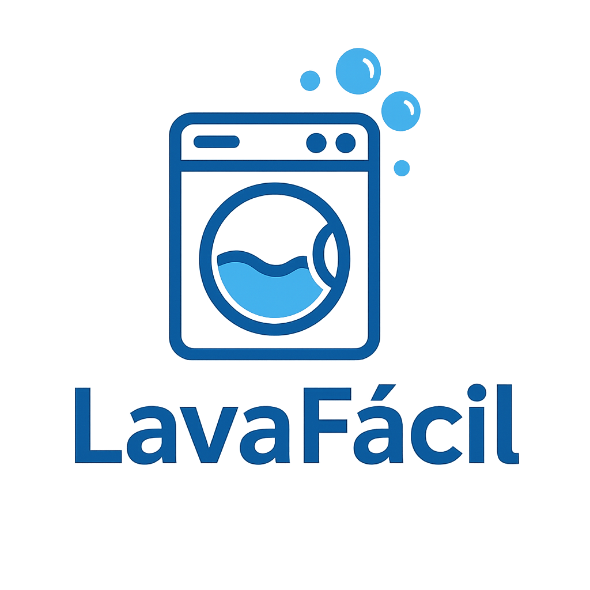

  

🧼 LavaFácil - Sistema de Gestión de Lavandería

📚 Tabla de Contenidos

1. Descripción General
2. ¿Qué Problema Resuelve LavaFácil?
3. Tecnologías y Herramientas Utilizadas
4. Arquitectura del Proyecto
5. Instalación Completa Paso a Paso
6. Configuración de Entorno .env
7. Orquestación Docker Detallada
8. Errores Comunes Documentados
9. Funcionalidades por tipo de usuario
10. Diseño UX/UI
11. Implementación de Modo Oscuro
12. Seguridad Aplicada
13. Comandos Útiles para Desarrollo
14. Mejoras Futuras Propuestas
15. Glosario de Términos Técnicos
16. Créditos y Agradecimientos

🧼 1. Descripción General

LavaFácil es un sistema integral para la administración de una lavandería. Permite gestionar clientes, pedidos, pagos, servicios ofrecidos y asignación de roles administrativos, todo a través de una aplicación web moderna, rápida y segura.

🔥 2. ¿Qué Problema Resuelve LavaFácil?

Agiliza la toma de pedidos y control de pagos.
Permite al dueño ver el estado de pedidos de cada cliente.
Centraliza la información para eliminar el uso de registros manuales o papel.
Facilita la administración de servicios, precios y clientes de manera automática.
Mejora la experiencia del cliente permitiendo visualizar el avance de su pedido.

🚀 3. Tecnologías y Herramientas Utilizadas

Herramienta	Uso Principal
Laravel 12	Backend robusto en PHP
React 18 + Inertia.js	Frontend SPA sin necesidad de API REST
TailwindCSS	Estilos modernos, adaptativos y modo oscuro
PostgreSQL 15	Base de datos relacional
Docker + Docker Compose	Contenerización y despliegue
Fortify	Seguridad y autenticación
Vite	Compilador de assets súper rápido

🏗️ 4. Arquitectura del Proyecto

lavafacil/
├── app/                # Lógica de servidor (Controllers, Models, Middleware)
├── database/           # Migraciones y Seeders
├── resources/js/       # Código Frontend en React
│   ├── Pages/          # Vistas principales
│   ├── Components/     # Componentes reutilizables
├── public/             # Recursos públicos (logo, favicon)
├── docker/             # Configuración Nginx personalizada
├── docker-compose.yml  # Orquestador de contenedores
├── tailwind.config.js  # Configuración Tailwind
└── vite.config.js      # Configuración Vite
🛠️ 5. Instalación Completa Paso a Paso

# 1. Clonar repositorio
git clone https://github.com/santiagoabasto/lavafacil.git

# 2. Ingresar a la carpeta
cd lavafacil

# 3. Levantar contenedores con Docker
docker-compose up -d --build

# 4. Ingresar al contenedor PHP
docker exec -it lavafacil_app bash

# 5. Instalar dependencias PHP
composer install

# 6. Crear archivo .env
cp .env.example .env

# 7. Generar clave de aplicación
php artisan key:generate

# 8. Ejecutar migraciones + seeders
php artisan migrate:fresh --seed

# 9. Instalar dependencias JS
npm install

# 10. Compilar Frontend
npm run dev
⚙️ 6. Configuración de Entorno .env

Variables principales configuradas:

Variable	Descripción
DB_CONNECTION=pgsql	Tipo de base de datos
DB_HOST=db	Nombre del servicio en Docker
DB_PORT=5432	Puerto de conexión PostgreSQL
DB_DATABASE=lavafacil	Nombre de la base
DB_USERNAME=postgres	Usuario de DB
DB_PASSWORD=secret	Contraseña de DB
🐳 7. Orquestación Docker Detallada

App: Laravel 12 en PHP-FPM 8.2 (lavafacil_app)
DB: PostgreSQL 15 (lavafacil_db)
Web server: Nginx alpine (lavafacil_web)
Comunicación:

Servicio	Accede a
App	Base de datos mediante host db
Web	Sirve contenido estático de /public
Puertos expuestos:

localhost:8000 → Nginx
localhost:5432 → PostgreSQL

🐞 8. Errores Comunes Documentados

Error	Causa	Solución
mv: cannot stat 'composer.phar'	Composer no descargado	Instalar composer manualmente
could not translate host name "db" to address	Servicio DB no levantado a tiempo	Reiniciar docker-compose
could not find driver (Connection: pgsql)	Falta extensión PHP PDO_PGSQL	Habilitar y reconstruir imagen
relation "sessions" does not exist	Migraciones no corridas	php artisan migrate:fresh
Target class [PedidoController] does not exist	Error en ruta/controller	Revisar imports correctos

✨ 9. Funcionalidades por tipo de usuario

Cliente:

Registro y login
Selección de servicios
Generación de pedidos
Consulta de pedidos
Administrador:

Gestión de pedidos
Cambio de estado de pedidos
Confirmación de pagos
Visualización de ventas

🎨 10. Diseño UX/UI

Interfaz limpia y minimalista
Enfoque mobile-first
Animaciones suaves de carga
Modo oscuro nativo
Inputs y botones accesibles

🌗 11. Implementación de Modo Oscuro

Detecta automáticamente preferencias del sistema
Alternancia manual tipo "Switch iOS"
Persistencia en localStorage
Clases dark: en TailwindCSS

🔐 12. Seguridad Aplicada

CSRF Tokens automáticos
Middleware de verificación de autenticación
Roles controlados mediante Middleware role
Validaciones en frontend y backend
Hash de contraseñas con Bcrypt

🧪 13. Comandos Útiles para Desarrollo

# Subir servicios
docker-compose up -d

# Bajar servicios
docker-compose down

# Acceder al contenedor App
docker exec -it lavafacil_app bash

# Migrar base de datos
php artisan migrate:fresh --seed

# Instalar dependencias PHP
composer install

# Instalar dependencias Frontend
npm install

# Compilar Frontend para desarrollo
npm run dev

# Compilar Frontend para producción
npm run build

🎯 14. Mejoras Futuras Propuestas

Implementar notificaciones toast
Subir imágenes asociadas a pedidos
Convertir a PWA para modo offline
Soporte multilenguaje (Español/Inglés)
Dashboard analítico de ventas
Integración con pagos online

📚 15. Glosario de Términos Técnicos

Término	Definición
SPA	Aplicación de Página Única (Single Page Application)
Inertia.js	Librería para combinar Laravel + React
Middleware	Filtro entre solicitud y respuesta HTTP
TailwindCSS	Framework CSS basado en utilidades
Docker Compose	Orquestador de múltiples contenedores Docker
Vite	Herramienta moderna para empaquetar Frontend

🙌 16. Créditos y Agradecimientos

Proyecto desarrollado por Santiago Abasto
Última actualización: 29/04/2025
Gracias a la comunidad de Laravel, React y Docker por las herramientas increíbles que hacen proyectos como este posibles. 🚀